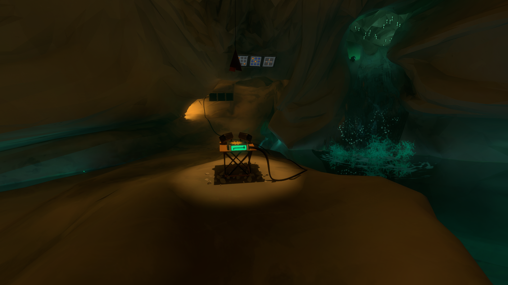
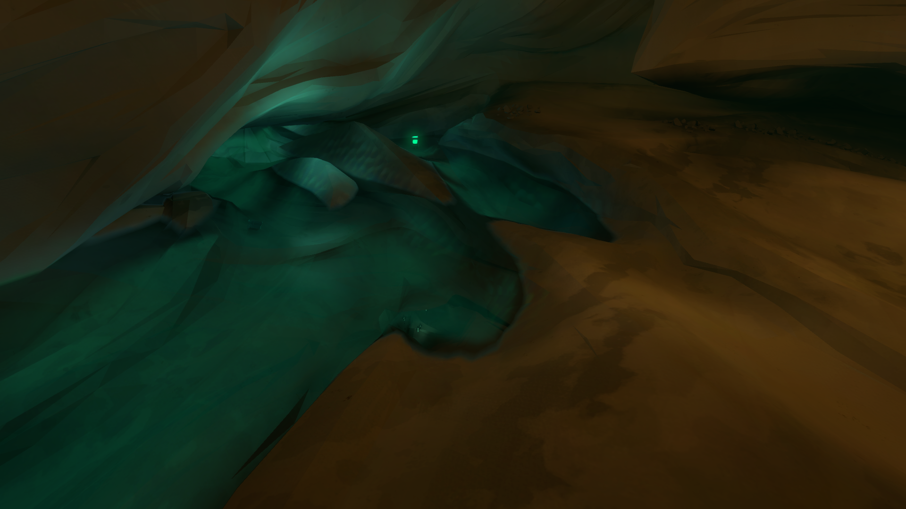
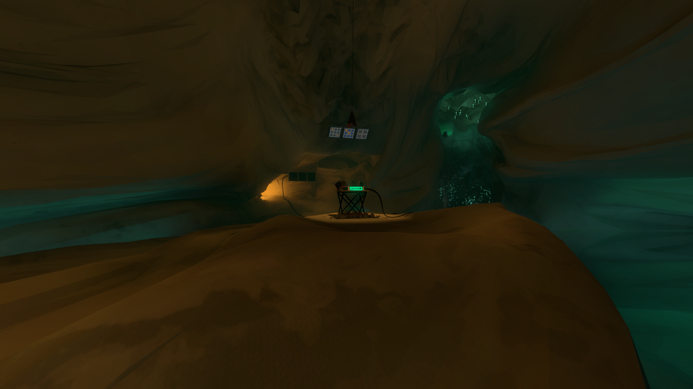

# The Witness Challenge Bot
A bot made to speedrun The Challenge in the game The Witness

## How to Use
### Prerequisites
1. Windows computer capable of running The Witness at 60 fps in 1080p (Linux may also work if you can get mss working)
2. A 1920x1080 monitor (Support for larger resolutions may be added in the future)
3. [Python 3.9](https://www.python.org/downloads/release/python-390/) (Other Python versions should also work)
4. Copy of The Witness

### Setup
1. Clone or download this source code
2. Install requirements
   * From the command line, cd into the source code folder, then run `pip install -r requirements.txt`
3. Configure the following settings in The Witness
   * Resolution: 1080p (must be native and fullscreen)
   * Fullscreen: Yes
   * Field Of View: 100 (exactly)
   * Mouse Softening: All the way to the left
   * Invert Mouse (both axes): No
   * Mouse Control: FPS Mouselook
4. Launch The Witness. It should be running at 1920x1080 natively on a screen of the same resolution. If you have multiple screens, make note of which it is on.
5. From a command line, run the command `python`, then run `import mss; from matplotlib import pyplot; import numpy; sct=mss.mss(); pyplot.imshow(numpy.array(sct.grab(sct.monitors[1]))[:,:,:3]); plt.show()`
6. A window should appear which shows a screenshot of one of your monitors. If the monitor shown is the monitor The Witness was running on, you're all set
 * If the correct monitor did not appear you will need to figure out which monitor The Witness is running on
 * If you do not know, try running the following command, replacing 1 with 2, 3, etc. `pyplot.imshow(numpy.array(sct.grab(sct.monitors[1]))[:,:,:3]); plt.show()`
 * Once you determine the correct monitor, edit the file witness.py and find the line `MONITOR = 1` (approx line 23). Replace the number 1 with the proper number

### Run
1. Ensure that there is nothing on top of The Witness's window (No screen recording software, timers, etc. These will confuse the bot.)
2. In The Witness, walk to the start of the challenge, approximately at this location

3. Turn around, and notice the left-most peninsula as shown in the image below

4. Walk as far onto that peninsula as possible, then turn around and position the music box at approximately the center of the screen

5. Run witness.py through the GUI of your choice, or through the command line by changing directory into the project folder and running `python witness.py`
6. After waiting for several seconds, the bot will look for the escape screen. Once you open the escape screen in The Witness, the bot will exit the escape screen and start the challenge. Using the mouse or the keyboard at this point will mess up the bot.
